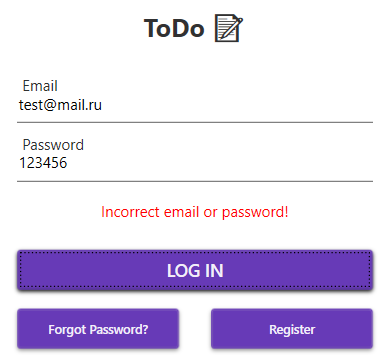
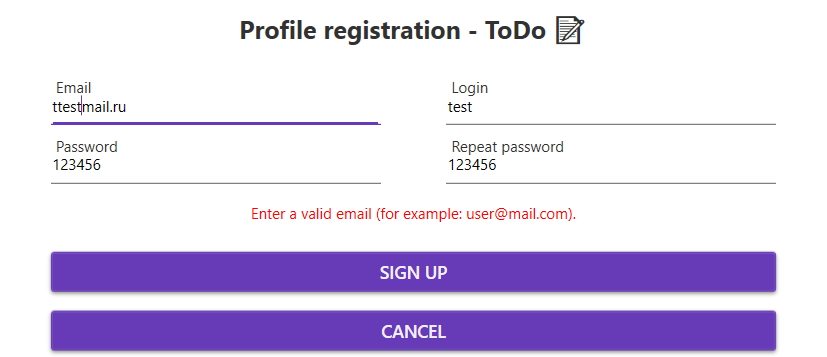
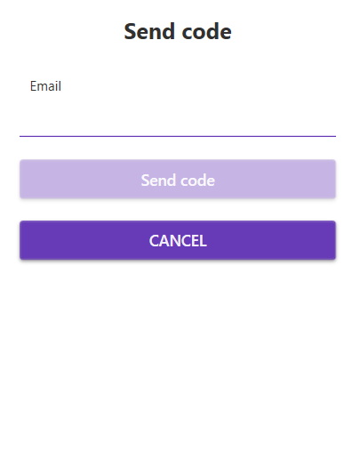
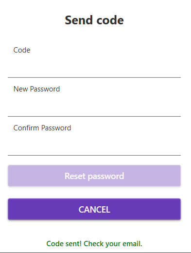
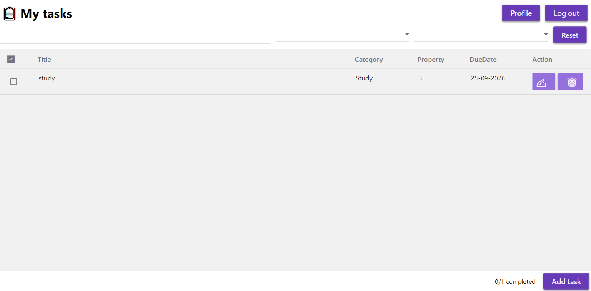
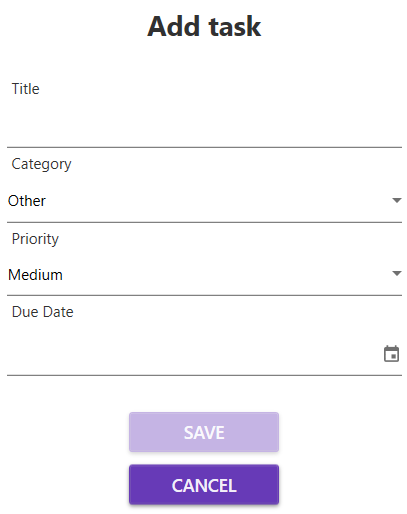
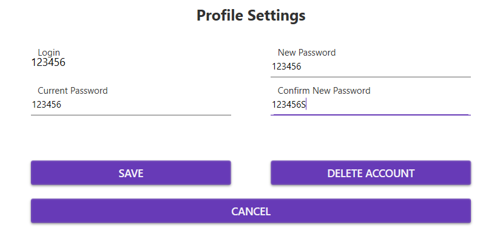

# 📝 ToDo — WPF приложение для управления задачами

---

## 🚀 О проекте

**ToDo** — это WPF-приложение, построенное на паттерне **MVVM**,
позволяющее пользователю:

- ✅ Регистрироваться и входить в систему (пароли хешируются через BCrypt)
- 📧 Восстанавливать пароль через email-код (SMTP Mail.ru)
- ➕ Создавать, редактировать и удалять задачи
- 🔍 Фильтровать задачи по названию, категории и приоритету
- 👤 Менять пароль и удалять аккаунт

---

## 🖼 Скриншоты

<details>
<summary><b>🔐 Окно входа</b></summary>



</details>

<details>
<summary><b>📝 Регистрация</b></summary>



</details>

<details>
<summary><b>📧 Отправка кода на email</b></summary>



</details>

<details>
<summary><b>🔑 Ввод кода и нового пароля</b></summary>



</details>

<details>
<summary><b>📋 Главное окно — список задач</b></summary>



</details>

<details>
<summary><b>➕ Добавление / редактирование задачи</b></summary>



</details>

<details>
<summary><b>⚙️ Профиль и настройки</b></summary>



</details>

---

## 🛠 Технологии

<details>
<summary><b>Показать полный стек</b></summary>

| Слой | Технология |
|------|------------|
| UI | WPF (.NET Framework 4.8) |
| Архитектура | MVVM |
| ORM | Entity Framework 6 |
| БД | SQLite (SQLite.CodeFirst) |
| Хеширование | BCrypt.Net |
| Email | System.Net.Mail (SMTP Mail.ru) |
| Тесты | MSTest |

</details>

---

## 🏗 Архитектура

<details>
<summary><b>Кратко о структуре</b></summary>

Проект построен на паттерне **MVVM**:

- **Views** — XAML-окна
- **ViewModels** — логика интерфейса
- **Services** — работа с БД, email, навигацией
- **Models** — сущности (Profile, UserTask)
- **Data** — контекст Entity Framework
- **Commands** — реализации ICommand для привязок

</details>

<details>
<summary><b>Основные классы</b></summary>

| Класс | Назначение |
|-------|-----------|
| LoginService | Авторизация, регистрация, восстановление пароля |
| TaskService | Добавление, изменение, удаление задач |
| EmailService | Отправка кода подтверждения на email |
| NavigationService | Переключение между окнами |
| AppDbContext | Контекст EF6 для работы с SQLite |

</details>

---

## ⚙️ Установка и запуск

<details>
<summary><b>Требования</b></summary>

- Windows 10/11
- Visual Studio 2019/2022
- .NET Framework 4.8
- NuGet-пакеты: EntityFramework, System.Data.SQLite, SQLite.CodeFirst, BCrypt.Net-Next

</details>

<details>
<summary><b>Шаги запуска</b></summary>

**1. Клонировать репозиторий:**
```
git clone https://github.com/DilyaraD/ToDo.git
```

**2. Открыть ToDo.sln в Visual Studio.**

**3. Восстановить NuGet-пакеты.**

**4. Создать файл EmailSecrets.cs** в папке `ToDo/Services/` со следующим содержимым:
```csharp
namespace ToDo.Services
{
    public static class EmailSecrets
    {
        public const string SenderEmail = "yourEmail@mail.ru";
        public const string SenderPassword = "yourAppPassword";
    }
}
```

**5. Собрать решение и запустить проект.**

</details>

---

## 🧪 Тестирование

<details>
<summary><b>Что покрыто тестами</b></summary>

Проект UnitTestToDo содержит 9 unit-тестов:
- `UnitTest1.cs` — валидация email (5 тестов)
- `UnitTest2.cs` — модель UserTask (4 теста)

Запуск: **Test → Run All Tests**

</details>

<details>
<summary><b>Список тестов</b></summary>

| Тест | Проверяет |
|------|-----------|
| TestMethod1_IsValidEmail | Корректный email (user@mail.com) |
| TestMethod2_IsValidEmail_NoAtSymbol | Отсутствие @ |
| TestMethod3_IsValidEmail_NoDomain | Отсутствие домена (user@) |
| TestMethod4_IsValidEmail_Empty | Пустую строку |
| TestMethod5_IsValidEmail_Whitespace | Строку из пробелов |
| TestMethod1_IsCompletedFalse | IsCompleted по умолчанию = false |
| TestMethod2_DueDateNull | DueDate по умолчанию = null |
| TestMethod3_SetTitle | Установку Title |
| TestMethod4_SetDueDate | Установку DueDate |
</details>
